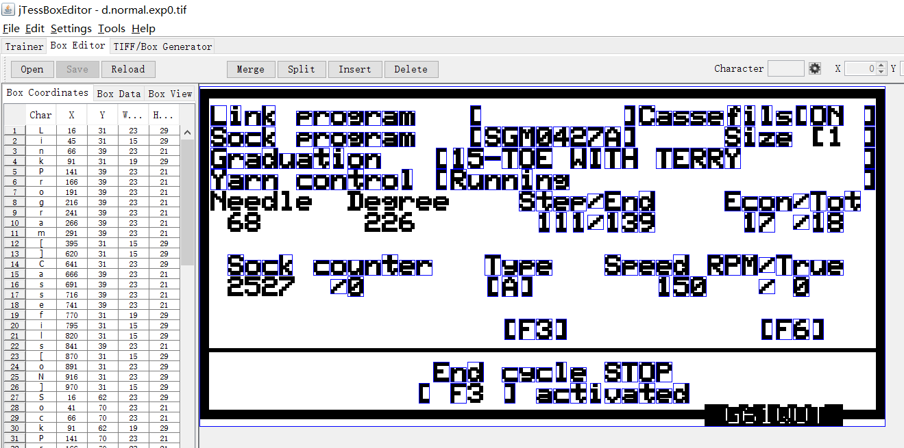
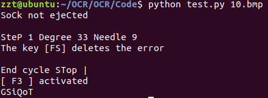
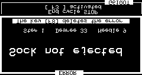

<center>
    <font size=5>计算机视觉大作业报告——用深度学习实现字符识别</font><br/>
    <font size=4>组号：13</font><br/>
    <font size=4>组员：张政童、方俊杰、李青弈</font><br/>
</center>

## 光学字符识别OCR概述
光字符识别 Optical Character Recognition (OCR)一直是一项计算机视觉的重要应用， 随着人工智能的发展，特别是深度学的流行，深度学习方法开始被广泛应用在 OCR 领域。被谷歌资助的 Tesseract 项目自 2006 年问世以来，一直是业界的领导。而该系统的 Version 4.0 引入了 LSTM 技术，该项目已达到行业标准的水平。 

## 大作业工作内容
1. 积极提交项目进展报告

2. 对项目文档进行理解和认识

3. 对代码不清晰或较难理解部分做出梳理，整理文档

4. 实现并优化图像处理方法，提高识别准确度
考虑原图片过小, 我们首先使用了最近邻插值将原本240x128大小的图片转换为1000x500像素, 然后继续了开操作消除毛刺, 继而对镜像反转的图片进行镜像使得文字正置。考虑到背景黑色可能影响到识别，将整张图片像素值黑白倒置，转换为白底黑字，但又存在三个部分文字与此矛盾，对该三部分再进行黑白导致使得所有文字都为白底黑字。这同时也去除了一些框，可以提高识别率。

5. 换用识别、训练、分类等核心算法，尝试提高识别准确度  

6. 识别准确率统计

## 一、对项目文档进行理解和认识
    lqy的东西
## 二、对代码的梳理
    还是lqy的东西
## 三、图像处理
    还剩fjj和lqy的东西
*   镜像处理：  
    简单地创建一个原图像的副本，使用 **img2[j][i] = img[y - j - 1][i]** 进行像素翻转即可
    ```
    def mirror(self):
        img = self.Interpolation()
        y = img.shape[0]
        x = img.shape[1]
        img2 = copy.deepcopy(img)
        for i in range(x):
            for j in range(y):
                if self.filename != "2.bmp" :
                    img2[j][i] = img[y - j - 1][i]
        path = self.filename[0:self.filename.find('.')+1] + "tif"
        path = self.img_save_path + "d.normal.exp" + path
        print(path)
        img2 = self.invertBW(img2)
        cv2.imwrite(path, img2)
    ```
*   最近邻插值  
    由于bmp图像的像素点太少，需要对其进行像素点的扩充,
    原图为128 * 240，临近插值后为500 * 1000

    ```
     def Interpolation(self):
        img = copy.deepcopy(self.img)
        height,width,channels =img.shape
        emptyImage=np.zeros((500,1000,channels),np.uint8)
        sh=500.0/height#y
        sw=1000.0/width#x
        for i in range(500):
            for j in range(1000):
                x=int(i/sh)
                y=int(j/sw)
                if x >= 128 or y >= 240:
                    print("ERRROR,", x, y, i, j)
                    exit(1)
                emptyImage[i,j]=img[x,y]
        kernel = np.ones((3,3))
        return cv2.morphologyEx(emptyImage, cv2.MORPH_OPEN, kernel)
    ```
## 四、使用jTessBoxEditor训练，提高准确率
1.  ### 在window环境下安装jTessBoxEditor。
2.  ### 将源图片转换成tif格式，更改名字为[lang].[fontname].exp[num].tif的格式，用于生成box文件。
    *   lang：语言
    *   fontname：字体
    *   num：代表自身的数字
3.  ### 使用jTessBoxEditor将十张图片整合成一张图片：
    jTessBoxEditor->Tools->Merge TIFF->"Select pictures"->Save as "d.normal.exp0.tif"
4.  ### 生成box文件：
     ```
    tesseract d.normal.exp0.tif d.normal.exp0 -l eng1 batch.nochop makebox
    ```
5.  ### 用jTessBoxEditor打开d.normal.exp0.tif图片，会自动载入box文件，图形化地来观察识别结果
    
    对结果进行纠错：在左边地列表里修改Char、X、Y、W、H应当的值即可
6.  ### 训练流程：
    步骤：
    *   训练并生成train文件，即以.tr结尾的文件
    *   计算字符集合
    *   生成中间文件
    *   重命名中间文件
    *   集成这些中间文件为d.normal.traineddata
    *   删除中间文件  

    bat脚本：
    ```
    echo Run Tesseract for Training..  
    tesseract  d.normal.exp0.tif d.normal.exp0  nobatch box.train
    
    echo Compute the Character Set..  
    unicharset_extractor d.normal.exp0.box  
    mftraining -F font_properties -U unicharset -O d.unicharset d.normal.exp0.tr  
    
    echo Clustering..  
    cntraining.exe d.normal.exp0.tr  
    
    echo Rename Files..  
    rename normproto d.normproto  
    rename inttemp d.inttemp  
    rename pffmtable d.pffmtable  
    rename shapetable d.shapetable   
    
    echo Create Tessdata..  
    combine_tessdata d.  

    echo Delete useless file
    del unicharset,d.unicharset,d.shapetable,d.pffmtable,d.normproto,d.normal.exp0.tr,d.inttemp
    ```
7.  使用自己的训练结果进行图片识别：  
    将d.normal.traineddata放入Linux系统里的 ~/usr/share/tesseract/4.00/tessdata里，并将test.py里的config所使用的语言改成d即可。

## 五、程序使用方法：
*   进入Code目录下，输入以下命令
    ```
    python test.py [picture_name]
    ```
    即可自动载入Pic目录下的图片，并在terminal里输出识别结果
    Demo:  
    
*   test.py文件同样会让识别的结果写入Result路径下的result_[picture_name].txt里
    

## 六、识别样例
* 原图片：  

* 处理后的图片：

* 识别出的文本：
```
    SoCk not ejeCted

    SteP 1 Degree 33 Needle 9
    The key [FS] deletes the error

    End cycle STop |
    [ F3 ] activated
    GSiQoT
```
## 七、识别准确率分析
### 要求：
1.  Total: 全部字符数 
2.  Correctly Recognized: 正确识别字符数 
3.  Incorrectly Recognized: 错误识别字符数 
4.  Redundantly Recognized: 图像中并不存在，但被错误识别出的字符数
5.   Miss-Recognized: 图像中存在，但没有被识别的字符数 
 
*   True Positive: Correctly Recognized 
*   False Positive: Incorrectly Recognized + Redundantly
*   Recognized True Negative: Total Number - Redundantly
*   Recognized False Negative: Miss-Recognize

*   **_Sensitivity: true positive / (true positive + false negative)_**
*   **_Specificity: true negative / (true negative + false positive)_**

| 图片编号 | Sensitivity(%) | specificity(%) |
| :---:   | :---------: | :-------: |
| 1  | 26.3  | 100  |
| 2  | 86.5  | 97.8 |
| 3  | 96.0  | 90.9 |
| 4  | 95.7  | 96.7 |
| 5  | 95.4  | 96.5 |
| 6  | 95.6  | 95.9 |
| 7  | 96.0  | 94.8 |
| 8  | 95.6  | 95.0 |
| 9  | 95.0  | 95.4 |
| 10 | 94.6  | 95.9 |

## 八、小组成员分工：
| 姓名 | ID | 学号 | 内容 |
| ------ | ------ | ------ | ------ |
| 张政童 | zztttt | 516030910024 | 搭建环境、图像处理、训练 |
| 方俊杰 | FJJLeon | 516030910006 | 图像处理、代码集成 |
| 李青弈| liqycarl | 516030910008 | 对文档的梳理、图像处理 |
项目进展详见
[commit history](https://github.com/zztttt/OCR/commits/master)

## Reference:
[An Overview of the Tesseract OCR Engine](https://github.com/tesseract-ocr/docs/blob/master/tesseracticdar2007.pdf)  
[Hybrid Page Layout Analysis via Tab-Stop Detection](https://github.com/tesseract-ocr/docs/blob/master/PageLayoutAnalysisICDAR2.pdf)  
[Github: tesseract](https://github.com/tesseract-ocr/tesseract)  
[tesseract识别与训练](https://www.cnblogs.com/wzben/p/5930538.html)  
